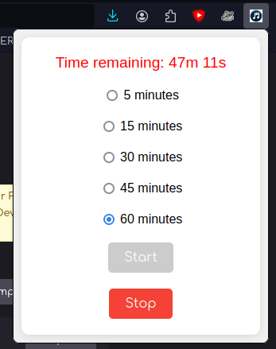
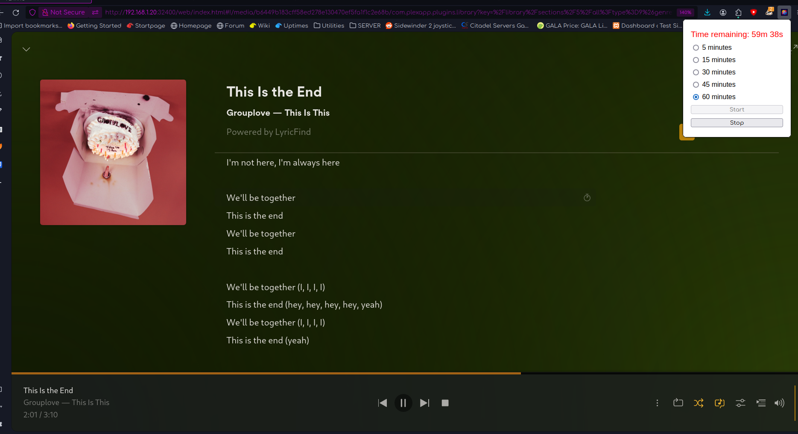

# Plex Lyrics Auto Clicker

## Overview

Plex Lyrics Auto Clicker is a Firefox extension that automatically clicks the lyrics button in the Plex Music player whenever a new song starts. It includes a user interface to start and stop the automation, and to set a timer for how long the automation should run. The extension ensures the lyrics button is only clicked if the lyrics are not already visible.

## Features

- Automatically clicks the lyrics button in the Plex Music player.
- Timer settings for 5, 15, 30, 45, or 60 minutes.
- Starts and stops the automation via a popup interface.
- Stores the current settings and restores them when the popup is opened.
- Displays a countdown timer showing the remaining time for the automation.
- Prevents repeated clicking if the lyrics are already visible.

## Installation

1. Clone or download this repository.
2. Open Firefox and go to `about:debugging`.
3. Click on `This Firefox`.
4. Click on `Load Temporary Add-on`.
5. Select the `manifest.json` file from the downloaded repository.

## Usage

1. Click on the extension icon in the Firefox toolbar to open the popup.
2. Select the desired duration (5, 15, 30, 45, or 60 minutes).
3. Click the `Start` button to begin the automation.
4. The extension will click the lyrics button every time a new song starts, for the selected duration.
5. Click the `Stop` button to stop the automation at any time.
6. The current settings and remaining time will be displayed when the popup is reopened.

