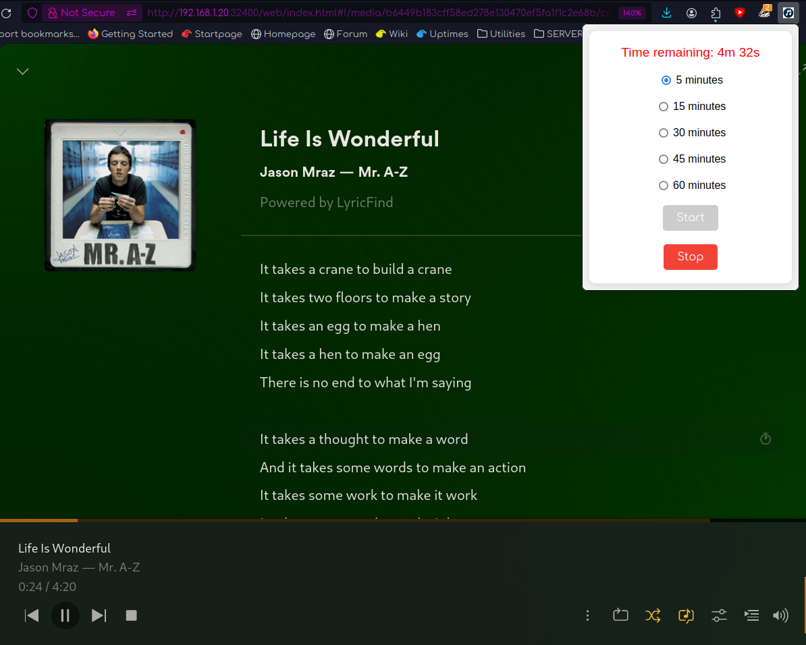

# Plex Lyrics Auto Clicker

## Overview

[Install for Firefox - https://addons.mozilla.org/en-US/firefox/addon/plex-lyrics-auto-clicker/](https://addons.mozilla.org/en-US/firefox/addon/plex-lyrics-auto-clicker/)

Welcome to the Plex Lyrics Auto Clicker, your new best friend for non-stop singing sessions!

We all love the Plex Music player, but having to manually open the lyrics each time a song changes can be a real buzzkill. This limitation exists due to the costs associated with fetching lyrics for every track. But don't worry, we've got you covered!

With the Plex Lyrics Auto Clicker, a nifty Firefox extension, you can enjoy seamless lyrics display without lifting a finger. Whether you're belting out tunes at your desk or leading a karaoke party, this extension ensures the lyrics are always on screen for at least a few songs in a row.

The extension features an intuitive interface to start and stop the automation, and you can even set a timer for how long you want the magic to last. So, get ready to sing your heart out without interruptions!

## Features

- Automatically clicks the lyrics button in the Plex Music player.
- Timer settings for 5, 15, 30, 45, or 60 minutes.
- Starts and stops the automation via a popup interface.
- Stores the current settings and restores them when the popup is opened.
- Displays a countdown timer showing the remaining time for the automation.
- Prevents repeated clicking if the lyrics are already visible.

## Installation

1. Clone or download this repository.
2. Open Firefox and go to `about:debugging`.
3. Click on `This Firefox`.
4. Click on `Load Temporary Add-on`.
5. Select the `manifest.json` file from the downloaded repository.

## Usage

1. Click on the extension icon in the Firefox toolbar to open the popup.
2. Select the desired duration (5, 15, 30, 45, or 60 minutes).
3. Click the `Start` button to begin the automation.
4. The extension will click the lyrics button every time a new song starts, for the selected duration.
5. Click the `Stop` button to stop the automation at any time.
6. The current settings and remaining time will be displayed when the popup is reopened.

